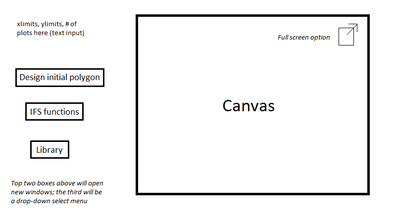

# Design

- User has two options:

  1. Create a new IFS
  2. Load an existing IFS

- User can produce a deterministic approximation of the attractor of an affine IFS, by specifying:

  - Number of functions (can be removed later)
  - Matrix transformations and shifts
    - Nice-to-have: option to adjust easily and auto-update display, e.g. using sliders for each parameter
  - Starting set
    - Always a polygon
    - User provides vertices
    - Nice-to-have: graphic user interface (point-and-click to specify the points)
  - Number of iterations

- Web app display:
  
  
  
  - Allow for different display options to be toggled on/off, e.g. gridlines, axes, colour
  
- User can save the image

- Option to add the input date (i.e. IFS functions, starting set, number of iterations) to a library for future use

  

  

  